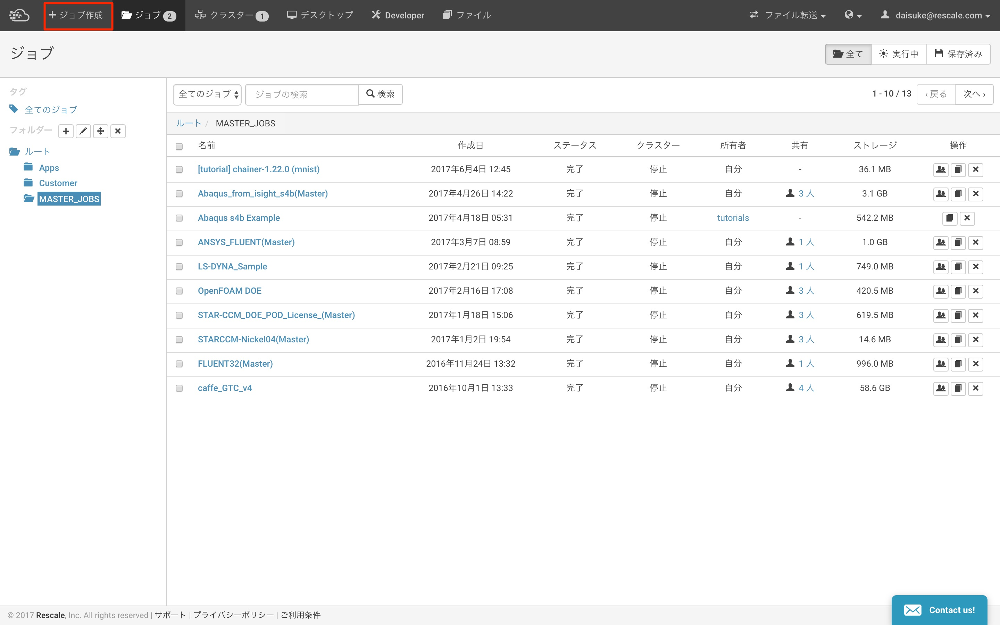
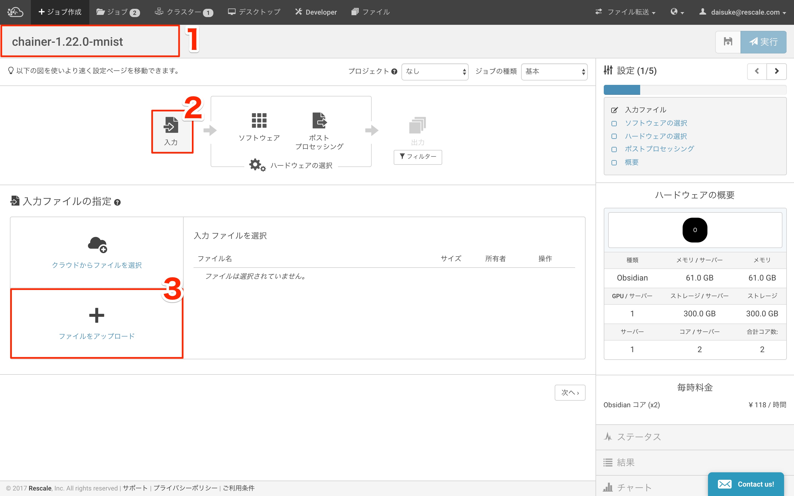
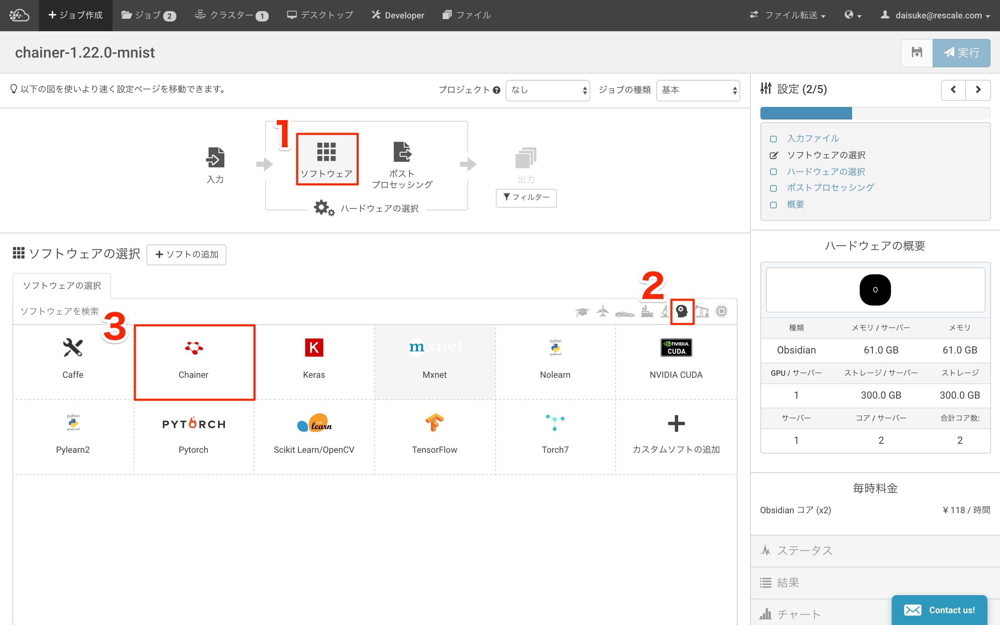
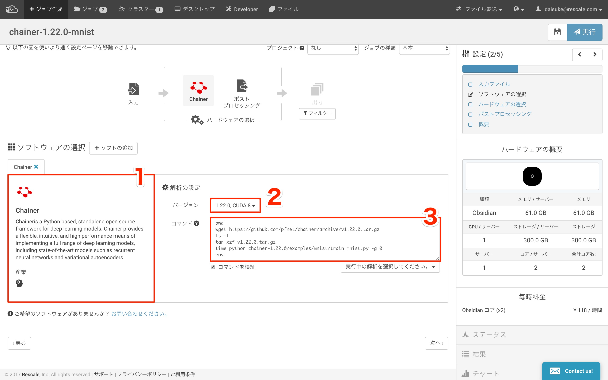
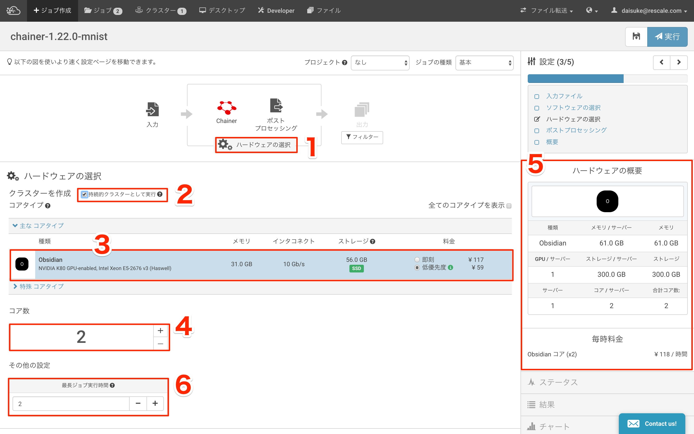
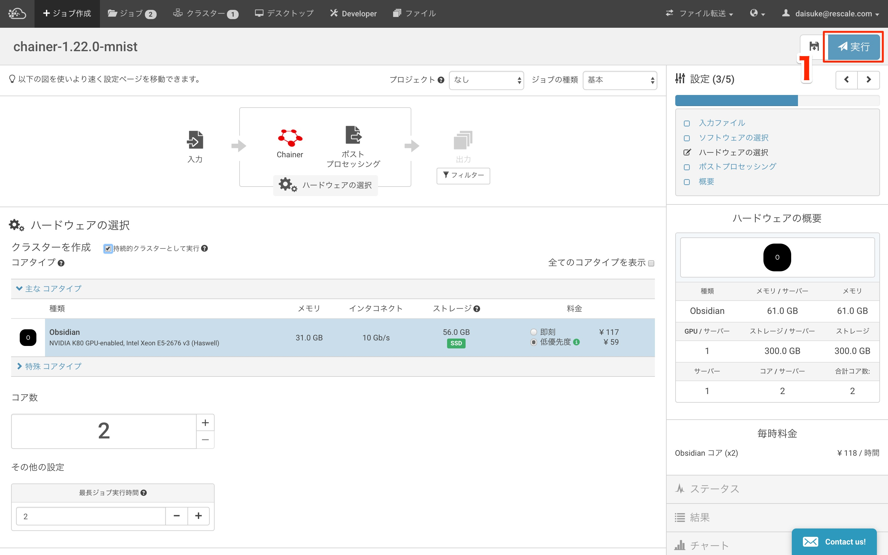
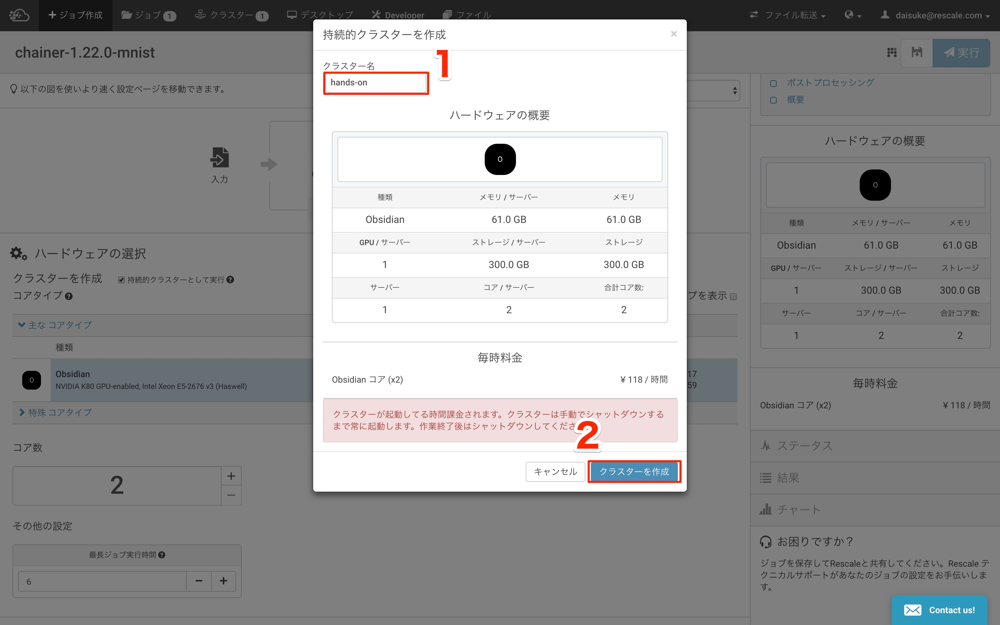
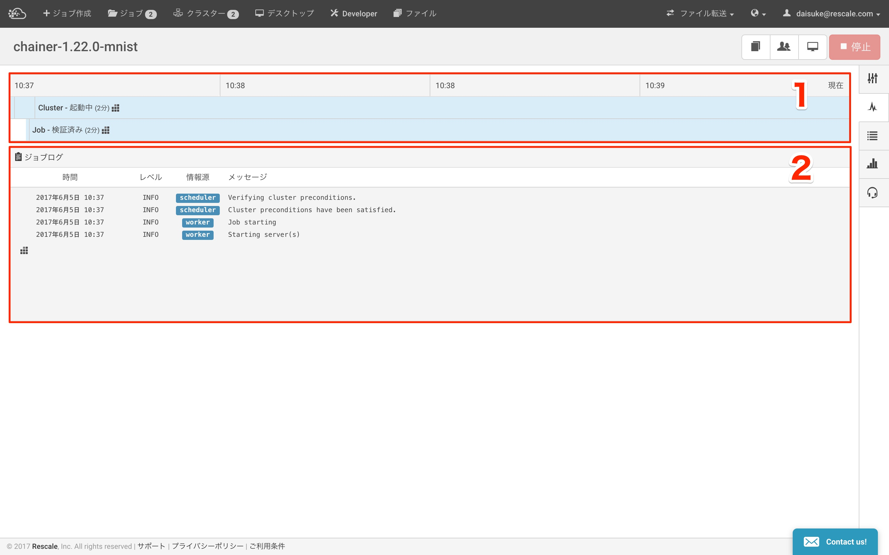

###################################
Chaniner Hands-on (Browser編)
###################################

|

ログインとジョブの作成
=====================

Rescaleへのログイン
--------------------

https://platform.rescale.jp/ をクリックして、ログインします。

|

ジョブの作成開始
--------------------

1. ログイン後、ジョブの作成をクリックします

|

入力ファイルのアップロード
================================

1. 任意のジョブ名をいれます
2. 入力をクリックします(下図と同じ画面であれば不要です)
3. 今回は、次の Rescale CLI ハンズ を見越して、``rescale.jar`` をアップロードします。このハンズオンのみであればこの作業は不要です。

|

ソフトウェアの選択/設定
================================

ソフトウェアの選択
-------------------------

1. ``ソフトウェア`` をクリックします。
2. ``Machine Learning`` のアイコンをクリックします
3. ``Chainer`` を選択します

|

ソフトウェアの設定
-------------------------

1. Chainer が選択されていることを確認します
2. バージョンを選びます (``1.22.0 cuda8``)
3. 下記のようにコマンドを入力します(コピペして貼り付けてください)

.. code-block:: bash

    pwd
    wget https://github.com/pfnet/chainer/archive/v1.22.0.tar.gz
    ls -l
    tar xzf v1.22.0.tar.gz
    time python chainer-1.22.0/examples/mnist/train_mnist.py -g 0
    env

|

HWの設定
================================

1. ``ハードウェアの選択`` をクリックします
2. ``持続的クラスタの実行`` にチェックをいれます
3. 選択されているコアを確認します。(i) のマークが緑であれば、``低優先度`` を選択します
4. ``コア数`` を確認します
5. コア数に応じて、``ハードウェアの概要`` に表示されているスペックと ``毎時料金`` が動的に変化することを確認します
6. ``最長ジョブ実行時間`` を入力します。この学習は半日程度かかるので今回は "3" と入力して、強制終了させます

.. note::
    | 持続的クラスタとは、ジョブが終わってもインスタンスがターミネートされない使い方です。
    | 今回は、このあとの Rescale CLI/API のハンズオンでこのクラスタにログインして作業するために使用します

|

ジョブの実行
================================

ジョブの実行
----------------

1. ``実行`` をクリックします

|

持続的クラスタの作成
------------------------

1. 任意の ``クラスタ名`` を入力します
2. ``クラスタの作成`` を入力します

|

クラスタの起動確認
----------------------

実行ボタンクリック後、下図に自動的に遷移します

1. ``Job - 検証済み`` で、``Cluster - 起動中`` になっていることを確認します(少し時間がかかります)
2. ``ジョブログ`` に ``Starting Server(s)`` になっていることを確認します

