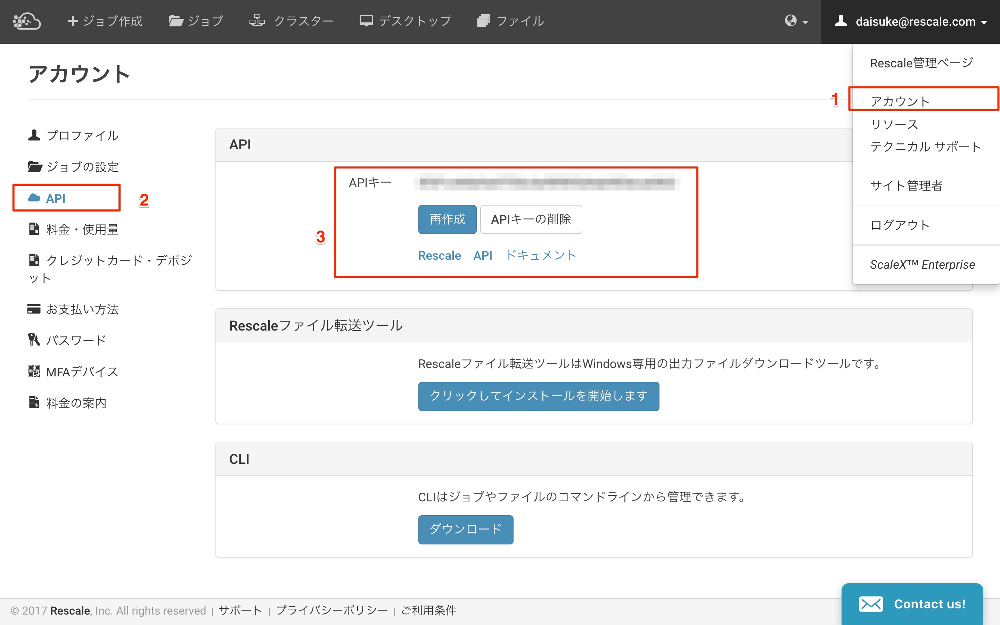

.. _createApiKey:

###################
API Key の作成手順
###################

STEP1: Rescaleへのログイン
============================

`Rescale へログイン <https://platform.rescale.jp/>`_ します。

|

STEP2: API Key の作成
============================

Rescale ログイン後下記を実施します。

1. アカウントをクリックします
2. APIをクリックします
3. APIキーの作成をクリックします

