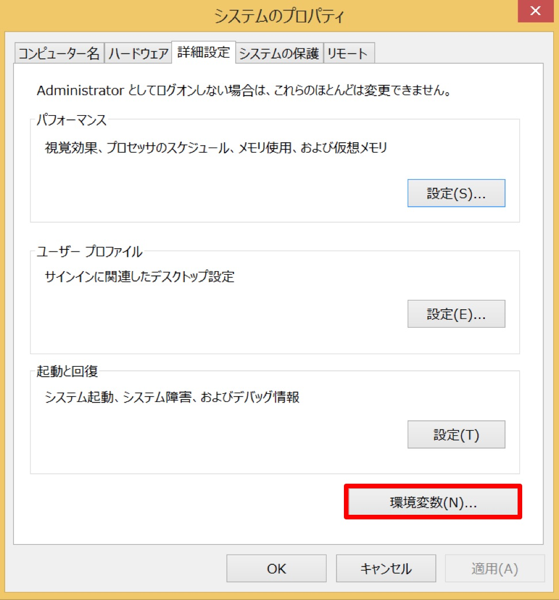
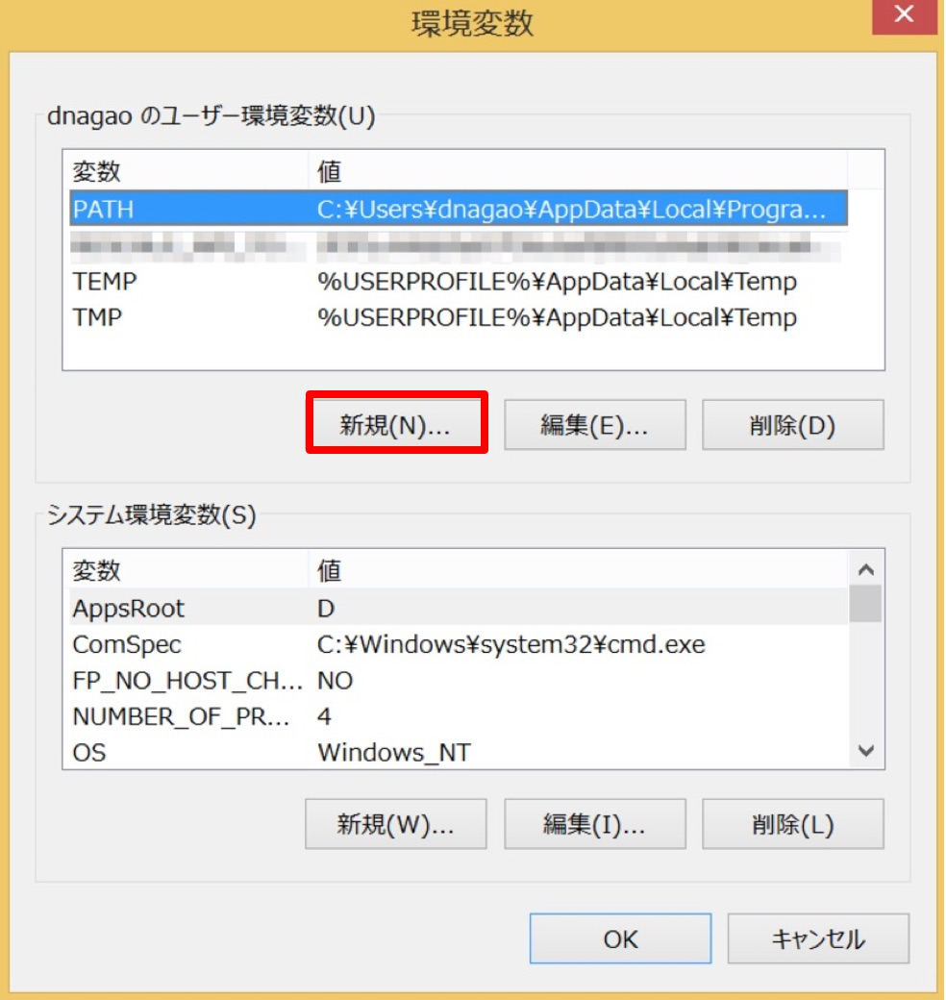

#############################
RescaleCLIのセットアップ方法
#############################

API Key の作成
============================================================

| コマンドラインから、Rescaleの認証/認可を得るため、API Keyを作成します。
| 操作方法は  ":doc:`./setupcli-create-apikey`"  をご参照ください。

CLI ツール rescale.jar のダウンロード
============================================================

| rescale CLI は JAVAで動きます。rescale.jarファイルをダウンロードします。
| 詳細なダウンロード方法は  ":doc:`./setupcli-download-jarfile`"  をご参照ください。

-----------------------------

Rescale CLI の使用準備 (LINUX)
============================================================

| ダウンロードした rescale.jar を適当なところへ保存します。
| この例では, `/usr/local/bin/` に保存しているものとします。

.. code-block:: bash

    sudo cp ./rescale.jar /usr/local/bin/rescale.jar

API KEYの設定
-------------------------

| API Key を設定します。毎回環境変数に設定するのは大変なので、``.bashrc`` 等に書き込む事でシェル起動時に設定されるようにします。

.. code-block:: bash

    echo "export RESCALE_API_TOKEN='<上記で作成したAPI_KEY>'" >> ~/.bashrc

.. note:: この設定することで、スクリプト内に API Key を直接書き込む必要がなくなります。これにより、ソースコードを送付時、直書きされたAPI Keyも一緒に送ってしまったり、githubへアップロードし公開しまったりという事故を未然に防ぐことができます。スクリプトには環境変数を呼び出し、``RESCALE_API_TOKEN`` の値を読み取るようにするよう実装してください。

-----------------------------

Rescale CLI の使用準備 (Windowsのとき)
============================================================

ダウンロードした rescale.ja を適当なところへ保存します。
ここでは例として ``C:¥rescale¥rescale.jar`` とします。

必要パッケージの準備
-------------------------

**1.Python (任意)**

- Windowsは シェルスクリプトのかわりに、つかっても良いかも。動作確認を行ったのは `ver 3.6.1 <https://www.python.org/downloads/windows/>`_ です)

**2.Visual C++ 再頒布可能パッケージ (任意)**

- 上記 Python をインストールした場合必要になりました
- 今回確認したバージョンは、`Visual Studio 2015  <https://www.microsoft.com/ja-jp/download/details.aspx?id=48145>`_ です

**3. JDK (必須)**

- Rescale CLI を動作させるために必須です
- 今回確認したバージョンは、`jdk-8u131-windows-x64.exe <http://www.oracle.com/technetwork/java/javase/downloads/jdk8-downloads-2133151.html>`_ です。

API KEYの設定
-------------------------

API Key を設定します。環境変数に書き込んでおき、プログラムのどこからでも、この変数を見られるようにします。

STEP1: ``コントロール > システムとセキュリティ > システム > システムの詳細設定`` と操作し、``環境変数`` をクリックします。

|

STEP2: ``新規`` をクリックします。

|

STEP3: **変数名(N):** ``RESCALE_API_TOKEN`` と **変数値(V):** ``<`あなたが作成した | API Key`>`` を設定します。API の作成方法は " :doc:`./setupcli-create-apikey` " をご参照ください。

入力後 ``OK`` をクリックして この設定を反映させます。

.. image:: ./images/win_enviroment_variable3.jpg
    :scale: 40%

|

.. note:: この設定することで、スクリプト内に API Key を直接書き込む必要がなくなります。これにより、ソースコードを送付時、直書きされたAPI Keyも一緒に送ってしまったり、githubへアップロードし公開しまったりという事故を未然に防ぐことができます。スクリプトには環境変数を呼び出し、``RESCALE_API_TOKEN`` の値を読み取るようにするよう実装してください。
