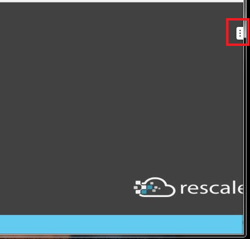
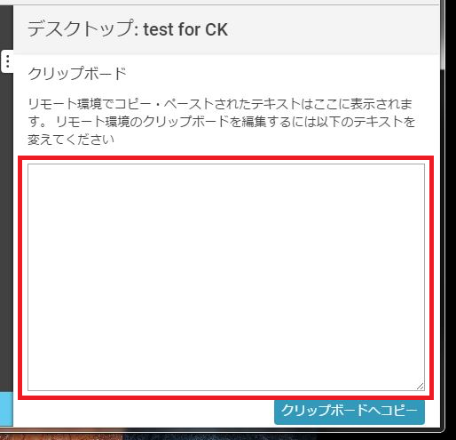

#####################################
ブラウザ内仮想デスクトップでコピー＆ペーストしたい
#####################################

:date: May 22, 2017
:author: Shinnosuke Furuya

ブラウザ内仮想デスクトップを起動します。
右上の方につまみがあり、そこをクリックするとコピー＆ペーストするための箱が出てきます。

