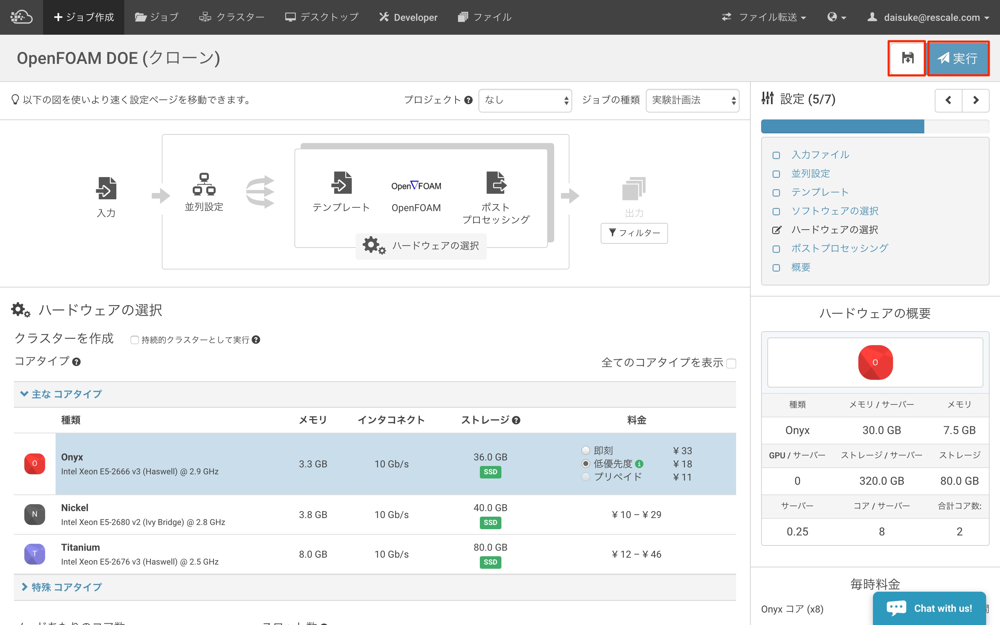

################################################################################
JOB ID とは何？
################################################################################

:date: June 6th, 2017
:author: Daisuke Nagao
:affiliation: Rescale Japan

JOB ID とは
================================================================================

ログイン後、既存のJobをブラウザでアクセスした時、そのURLが以下の場合, "jobs/" 以降の、"**XXXXXX**" がジョブIDに相当します。

- e.g.) ``https://platform.rescale.jp/jobs/XXXXXX/runs/1/results/``

|

JOB ID が生成されるタイミング
================================================================================

IDが生成されるタイミングは２つです。

1. create job: 下図の保存ボタン(フロッピーディスクのアイコン)をクリックしたとき
2. submit job: 下図の実行ボタンをクリックしたとき

|

.. note:: 正確にいうと、内部的には、"create Job" 時のみに、JOB ID が割り当てられます。ブラウザ上から "実行ボタン" を押すと、自動で "create Job" が行われ JOB ID を生成後、そのジョブを "submit" するという2段階で動作しています。 Rescale API を触るとその様子が分かります。
