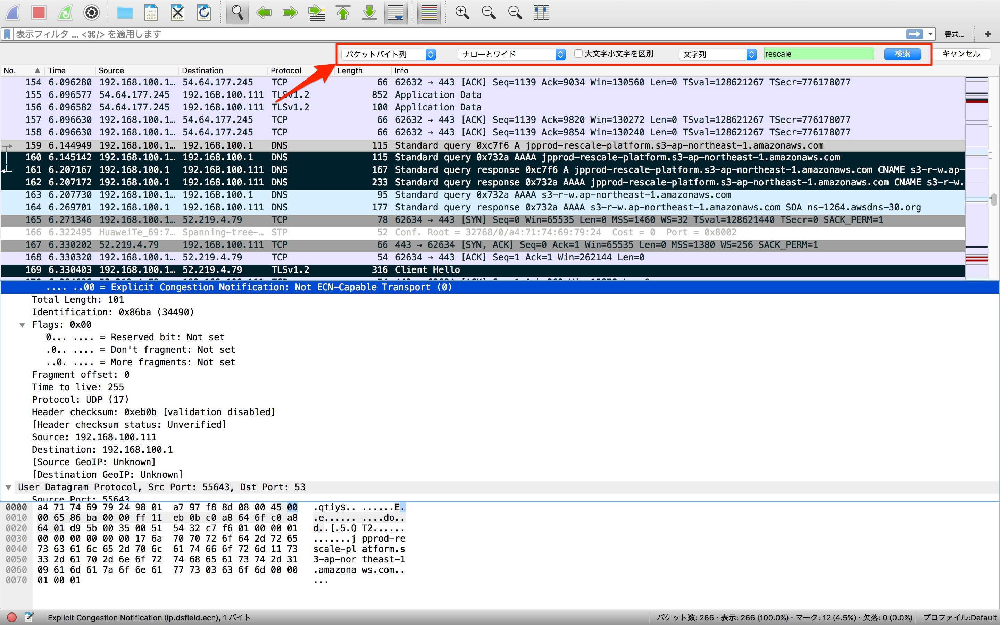

################################################################################
On-premise の Proxy に Rescale 接続用 の whitelist を登録する
################################################################################

:update: June 6th, 2017
:author: Daisuke Nagao

オンプレミスのプロキシーにRescale接続のためのホワイトリストを設定したいなどのご要望がありました。

そこで、Rescale に接続するための White list に登録するアドレスについて議論します。

|

Rescale に接続用 White list
================================================================================

結論から言うと Default ストレージとして Amazon S3 を選択されている場合、下記2つを登録すれば良いでしょう。

1. ``platform.rescale.jp``
2. ``jpprod-rescale-platform.s3-ap-northeast-1.amazonaws.com``

Rescaleは、BrowserからでもAPIでも、基本的には、RescaleのPlatform 経由、つまり ``platform.rescale.jp`` で、通信を行います。ただし例外もありあす。

|

**高速ファイル転送時の Cloud Storage へのダイレクトアクセス**

Rescale CLIや、Browserのファイル転送モードで "高速" を選ぶと、ファイル転送の高速化を目的とし、クラウドストレージへ直接アクセスします。

この時、ファイルの暗号化がローカルで行われ、さらにこの暗号化されたファイルを TLSv1.2 で通信するため、ナマのAPIをキックするときよりセキュリティー的にもより強固になるメリットがあります。

まとめると、``platform.rescale.jp`` の他に、このS3への直接アクセスのFQDN, ``jpprod-rescale-platform.s3-ap-northeast-1.amazonaws.com`` をプロキシーに登録する必要があります。

|

パケット解析による検証 (File のアップロード)
================================================================================

少し突っ込んで、`Wireshark <https://www.wireshark.org/download.html>`_ をつかってパケット解析をしてみました。

尚、パケットですが、下図のように ``パケットバイト列`` を選択し、``文字列`` で ``rescale`` で検索し、抽出しました。

|

|

以下結果を示しますが、プロトコル、DNSをみると、ちゃんとjpprod-rescale-platform.s3-ap-northeast-1.amazonaws.com があることが確認できます。

ちなみに、APIだけ使った場合は、もちろんこのアドレスは表示されません。

|

解析結果
--------------------------------------------------------------------------------

.. csv-table:: パケット解析結果, Rescale との通信のみを抽出しているため"No" は飛び飛びの値となっている
   :file: ./packet/fileupload.csv
   :encoding: euc-jp
   :header-rows: 1
   :widths: 5 5 10 10 5 5 60
